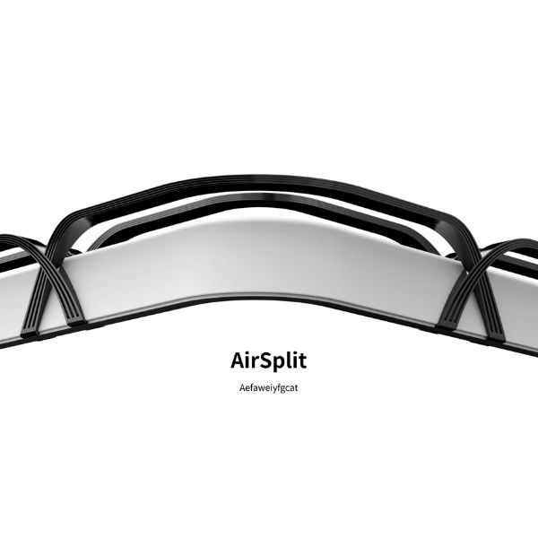

# AirSplit

[中文版 README](README.md)

AirSplit is an interdisciplinary design-engineering prototype that explores how airflow can become a spatial interface. This repository contains the embedded control system, interaction logic, and device-side communication for the AirSplit shower air-curtain separation system.


## Overview

AirSplit is built around the concept of "airflow as partition." Instead of relying on glass panels, shower doors, or raised thresholds, the project proposes a precision-controlled wind system to create dry-wet separation in the bathroom.

From a design perspective, AirSplit responds to three recurring issues in contemporary bathrooms:

- small spaces that feel visually crowded
- wet floors that increase slip risk and slow drying
- fixed physical partitions that reduce flexibility and accessibility

From a technical perspective, this project turns that design idea into a connected hardware prototype composed of a central control panel, fan control node, lighting node, and key input node.

## Exhibition Introduction

**Exhibited Project｜AirSplit Shower Air-Curtain Separation System**

AirSplit redefines bathroom layouts with the core concept of "airflow as partition." By replacing traditional glass panels and doors with a precision wind-control system, it achieves effective dry-wet separation while eliminating the visual clutter of small spaces. This airflow-driven approach also accelerates drying to prevent mold growth and enables a fully curbless, barrier-free floor plan. The result is a safer, more hygienic, and minimalist bathroom designed for modern living.

## Why This Project Matters

AirSplit is not only a form study or a control prototype. It is a design research project about how invisible media can reorganize domestic space.

Key design intentions:

- replace hard partition with a soft, dynamic boundary
- reduce visual pressure in compact bathrooms
- improve post-shower drying efficiency
- support a more accessible, curbless environment
- connect atmosphere, hygiene, safety, and interaction in one product concept

## Project Positioning

**Category**: Product Design  
**Type**: Interdisciplinary collaboration / design prototype / embedded interaction system

This project bridges:

- industrial and product design
- embedded systems and firmware
- interaction design
- environmental comfort and spatial experience

## Visuals

| Hero | Air curtain concept |
|---|---|
|  |  |

| Control interface | Structural detail 1 |
|---|---|
|  |  |

| Structural detail 2 | Structural detail 3 |
|---|---|
|  |  |

## Interaction Concept

The current prototype centers around a wall-mounted control panel and multiple distributed peripheral nodes.

Primary interaction themes:

- power control
- lighting control
- water-related mode switching
- wind mode selection
- timed airflow control
- status feedback through a circular visual interface

The panel prototype presents a reduced and legible interaction model:

- a central rotary knob for adjustment
- short and long press interaction
- dedicated mode switching for `Light`, `Water`, and `Wind`
- visual feedback for timer, level, and state changes

## System Architecture

The embedded system is organized as a small distributed device network.

### Core nodes

- `Panel`: the main UI controller with display, rotary input, button input, and application state management
- `Fans`: controls the airflow hardware, fan PWM output, relay, RPM measurement, and optional BLE debug channel
- `Key`: sends remote key events such as power, water, light, and wind
- `Lights`: controls the shower-area lighting relay
- `shared/mesh`: common message types, registry, and ESP-NOW communication layer

### Communication model

The system uses a lightweight ESP-NOW mesh-style communication layer with role-based routing.

Main roles defined in the code:

- `Panel`
- `Fans`
- `Key`
- `Lights`

Main message categories:

- `Cmd`
- `Event`
- `StatusReq`
- `StatusResp`
- `Ack`
- `Hello`

## Firmware Features

### Panel

The panel firmware is responsible for:

- UI rendering through LVGL
- rotary knob and button event handling
- application mode switching
- timer and state persistence
- peripheral command dispatch
- system status aggregation

Current application modes are defined in `src/panel/app/AppState.h`:

- `Idle`
- `Light`
- `Water`
- `Wind`

### Fan node

The fan node handles:

- relay enable and disable
- dual fan PWM duty control
- RPM pulse counting
- periodic fan status reporting
- BLE UART notifications for debugging and tuning

### Key node

The key node converts physical button presses into mesh events:

- power short press
- power long press
- water mode trigger
- light mode trigger
- wind mode trigger

### Light node

The light node acts as a focused peripheral:

- receives light on/off commands
- controls the light relay
- reports current state back to the panel

## Repository Structure

```text
src/
  panel/
    app/        Application state and controller logic
    config/     Display panel and LVGL configuration
    input/      Knob, button, and UART command routing
    ui/         LVGL-based rendering and assets
    utils/      UI support utilities
  peripheral/
    fans/       Fan controller firmware
    key/        Remote key input firmware
    lights/     Lighting controller firmware
  shared/mesh/  ESP-NOW messaging, registry, and routing
```

## Hardware and Software Stack

### Panel Hardware Reference

The main control panel for AirSplit is built on VIEWE's `UEDX46460015-MD50E` 1.5-inch touch knob display board. According to the vendor documentation, the board is based on ESP32-S3 and integrates a 466×466 round display, touch input, and rotary encoder, making it well suited for compact interaction prototypes centered around a single knob.

In this project, the board-specific parts include:

- `BOARD_UEDX46460015_MD50E`
- `GPIO_NUM_KNOB_PIN_A = 6`
- `GPIO_NUM_KNOB_PIN_B = 5`
- `GPIO_BUTTON_PIN = GPIO_NUM_0`
- panel initialization based on `ESP_Panel` and `ESP_Knob`

These settings can be found in `src/panel/config/ESP_Panel_Board_Supported.h` and `src/panel/main.cpp`.

### Software

- Arduino framework via PlatformIO
- LVGL 8.4 for the panel UI
- ESP-NOW for distributed node communication
- Preferences for simple persistent settings

### Hardware roles in this repo

- `Panel` environment targets an ESP32-S3 display board
- `Peripheral-Fans` targets a Seeed XIAO ESP32-C6-based node
- `Peripheral-Key` targets a Seeed XIAO ESP32-C6-based node
- `Peripheral-Lights` targets a Seeed XIAO ESP32-C6-based node

## Reference and Adaptation Notes

The panel-side hardware bring-up and board configuration reference VIEWE's public board resources and the `encoder15` example, especially for:

- board model and pin definitions
- basic display, touch, and rotary encoder initialization
- Panel-oriented PlatformIO and LVGL setup

However, AirSplit is not a direct reuse of the vendor example. It extends that starting point into a complete multi-node interaction system with:

- custom application states and mode logic
- a project-specific UI
- routed knob and button interaction handling
- distributed `Panel / Fans / Key / Lights` firmware roles
- a role-based ESP-NOW communication layer

A more accurate way to describe the relationship is:

> The AirSplit panel prototype uses the VIEWE `UEDX46460015-MD50E` 1.5-inch touch knob display board. Panel bring-up and some board-level settings reference the vendor's official development resources and the `encoder15` example, then were customized to fit AirSplit's interaction design and system architecture.

References:

- Official board repository: <https://github.com/VIEWESMART/UEDX46460015-MD50ESP32-1.5inch-Touch-Knob-Display>
- `encoder15` example: <https://github.com/VIEWESMART/UEDX46460015-MD50ESP32-1.5inch-Touch-Knob-Display/tree/main/examples/PlatformIO/encoder15>

## Build

This project uses PlatformIO.

### Build panel firmware

```bash
pio run -e Panel
```

### Build peripheral firmware

```bash
pio run -e Peripheral-Fans
pio run -e Peripheral-Key
pio run -e Peripheral-Lights
```

### Serial monitor

```bash
pio device monitor -b 115200
```

## Development Notes

This repository currently represents a prototype-stage implementation rather than a packaged consumer product.

That means the codebase prioritizes:

- clear interaction mapping
- modular node separation
- hardware bring-up flexibility
- rapid iteration between design intent and embedded behavior

Possible future directions:

- airflow calibration and closed-loop control
- environmental sensing for humidity and drying feedback
- installation-specific tuning profiles
- safer enclosure and waterproof integration
- expanded documentation for fabrication and system assembly

## Authors

### Feng-Yin Lin

- Email: `linfengyin186@gmail.com`
- Instagram: `@lazy_crocodile`
- Motto: Fall where you must, then rest there.

### Yueh-Tung Chen

- Email: `0525yueh@gmail.com`
- Instagram: `@_cyt_chen`
- Motto: +1

## License and Usage

Unless otherwise specified, this repository should be treated as a project documentation and prototype codebase for academic, exhibition, and collaboration use. Please contact the authors before commercial reproduction, redistribution, or derivative product development.
