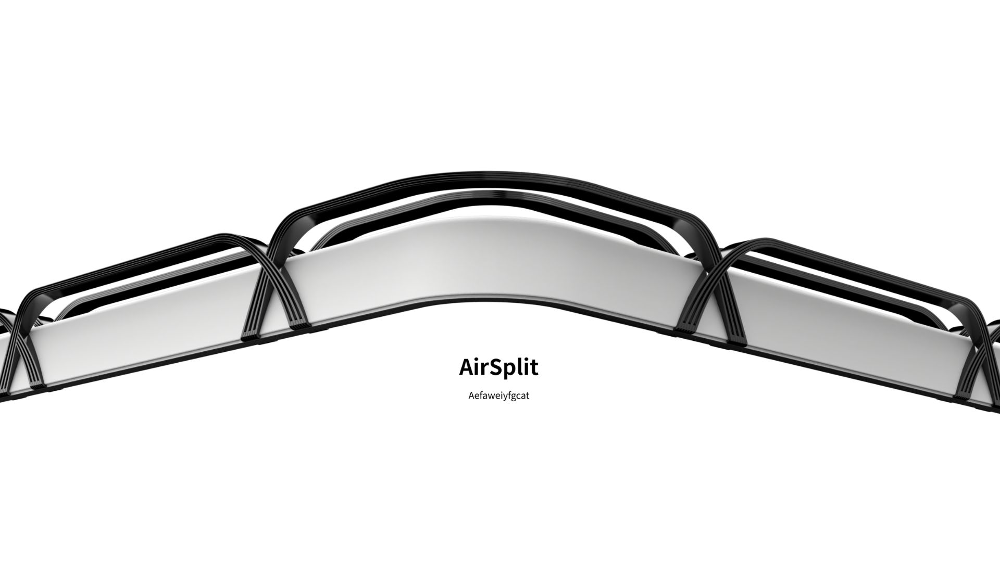
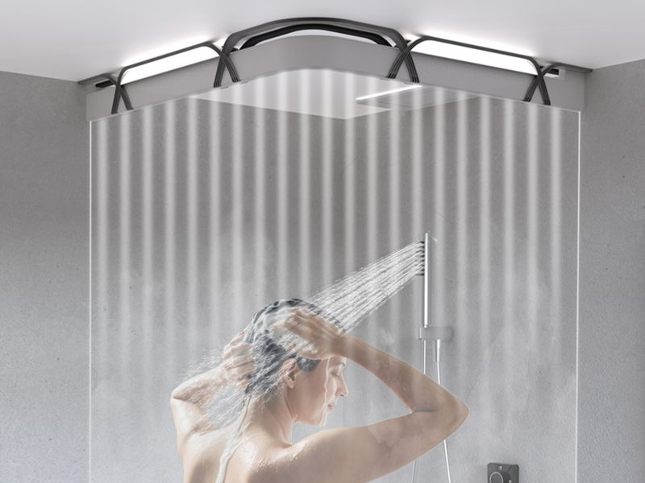
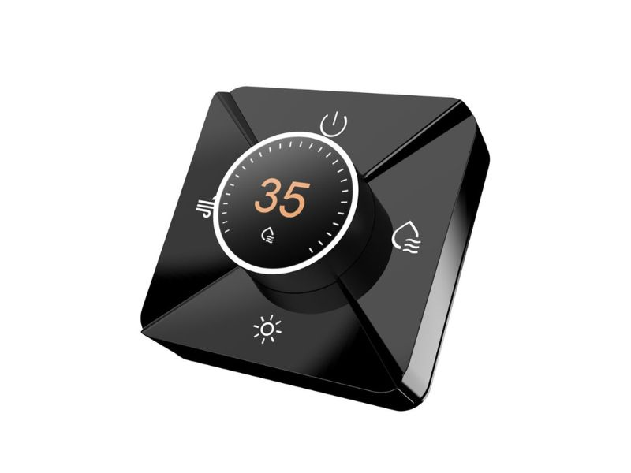
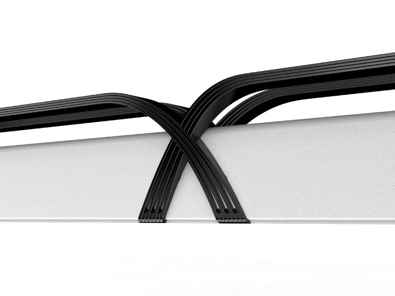
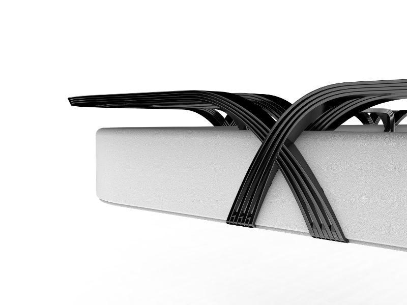

# AirSplit 淋浴隔水系統

[English Version](README.en.md)

AirSplit 以「氣流即隔間」為核心概念，挑戰傳統浴室必須依賴實體分隔的既有模式。透過精準控制的風力系統，在不使用玻璃或門片的情況下，實現乾濕分離，同時釋放小空間的視覺壓力。透過氣流促進浴室加速乾燥，降低黴菌孳生，以及提升安全性，實現全平面無障礙空間，打造更健康、舒適且具未來感的衛浴體驗。




## 問題定義

- 小型浴室容易因玻璃、門片或分隔件而顯得擁擠
- 洗澡後地面潮濕，乾燥速度慢，容易造成滑倒與黴菌問題
- 傳統乾濕分離多半依賴固定構件，不利於彈性使用與無障礙空間

## 解決方案

- 以風幕作為無形邊界
- 降低對實體隔間的依賴
- 在保有空間開放感的前提下建立乾濕分離效果
- 透過加速乾燥改善衛浴環境的衛生與安全

## 圖像

| 風幕情境示意 | 控制面板(Panel) |
|---|---|
|  |  |

| 結構細節1 | 結構細節 2 |
|---|---|
|  |  |


## 專案架構

### 核心模組

> Note: 見 `/platformio.ini`

- `Panel`：主介面控制器(旋鈕屏)，負責顯示、輸入、應用狀態與整體協調
  - 採用 [VIEWE 的 UEDX46460015-MD50E](https://github.com/VIEWESMART/UEDX46460015-MD50ESP32-1.5inch-Touch-Knob-Display)
  - Expressif Systems ESP32-S3(N16R8)
  - 1.5inch 466x466 OLED Touch Screen
  - 帶按鈕的編碼器
- `Peripheral-Fans`：送風電機
  - ESP32-C3 Super Mini: 電源/轉速控制、狀態回報(via ESP-NOW/Bluetooth LE, Dual Interface)
  - Delta GFC0812DW x1
  - 3.3V Relay Module x1
  - DCDC Module(12V-5V) x1
  - Powerful 12V power supply(more then 10A)
- `Peripheral-Key`：負責按鍵事件輸入
  - Seeed XIAO ESP32-C6: 在按鈕被按下時，透過 ESP-NOW 向 Panel 發送訊號。
  - Push-Button x4，分別為電源、水、燈、風。
- `Peripheral-Lights`：燈光邊界提示(提示風刀的位置)
  - Seeed XIAO ESP32-C5: 接收 Panel 的指示，來控制DCDC模塊的使能引腳達成對 LED 的開關
  - LED xN
  - DCDC Module with enable pin
- `shared/mesh`：
  - 所有節點共用的訊息格式、註冊表與 ESP-NOW 通訊層。
  - 主要實作 Panel 與 Fans, Key, Lights 周邊的通訊。

### 專案結構

```text
src/
  panel/
    app/        應用狀態與主控制邏輯
    config/     顯示面板與圖形介面設定
    input/      旋鈕、按鍵、UART 指令路由
    ui/         介面與素材
    utils/      UI 輔助工具
  peripheral/
    fans/       風扇控制節點
    key/        按鍵輸入節點
    lights/     燈光控制節點
  shared/mesh/  ESP-NOW 通訊、註冊表與訊息定義
```

## Build

本專案使用 PlatformIO。
在開始之前，請先安裝 PlatformIO。

### Build Panel Firmware

```bash
pio run -e Panel
```

### Build Peripheral Firmware

```bash
pio run -e Peripheral-Fans
pio run -e Peripheral-Key
pio run -e Peripheral-Lights
```

## 貢獻

### 設計端

- 產品設計
  - 外觀、操作流程、LoFi UI、icon
- 使用者體驗、人因工程

#### 林鋒殷 Feng-Yin Lin

- Email：`linfengyin186@gmail.com`
- Instagram：`@lazy_crocodile`

#### 陳玥彤 Yueh-Tung Chen

- Email：`0525yueh@gmail.com`
- Instagram：`@_cyt_chen`

### 工程端（me）

- HiFi UI
- 韌體開發、電路規劃
- 互動功能實作
